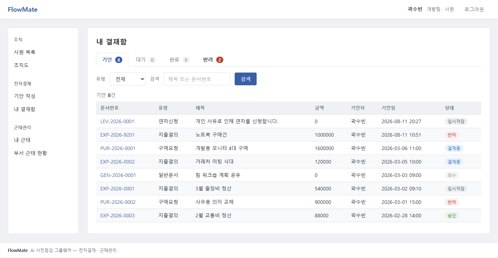
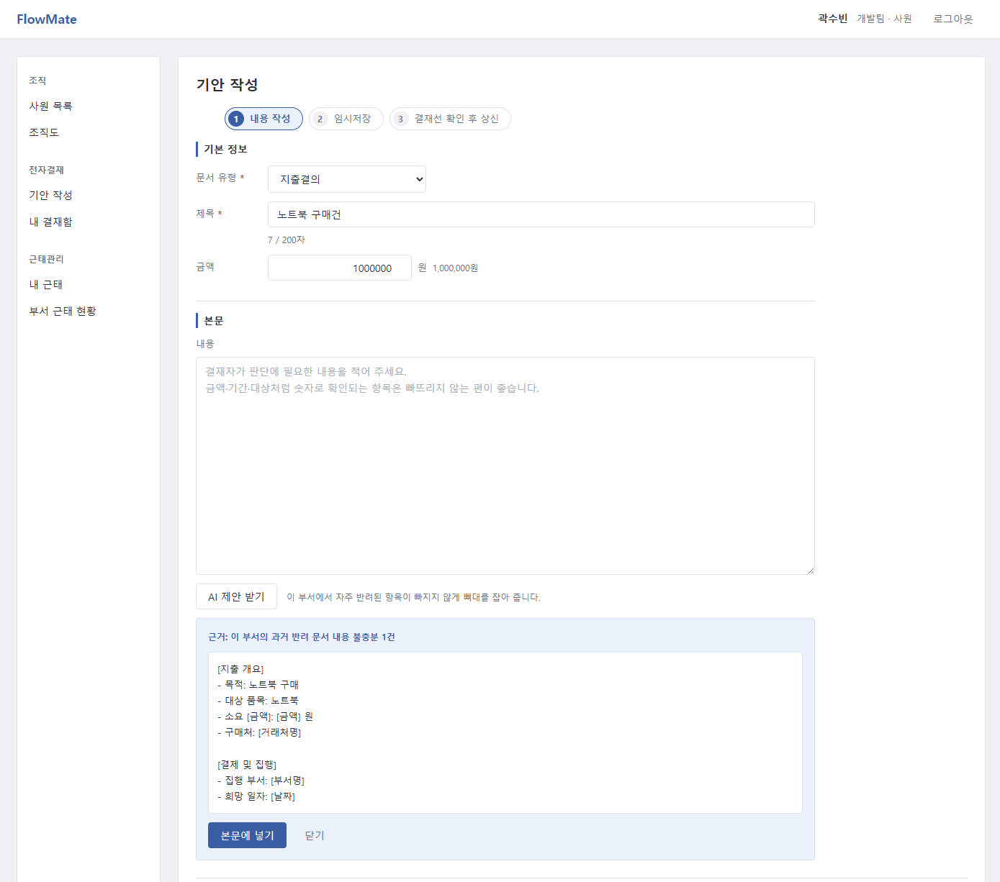
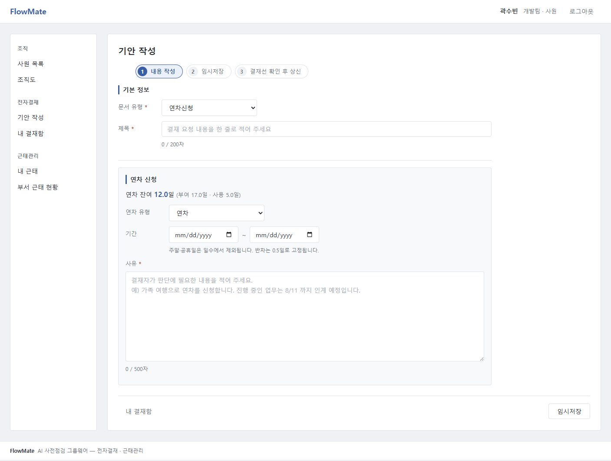
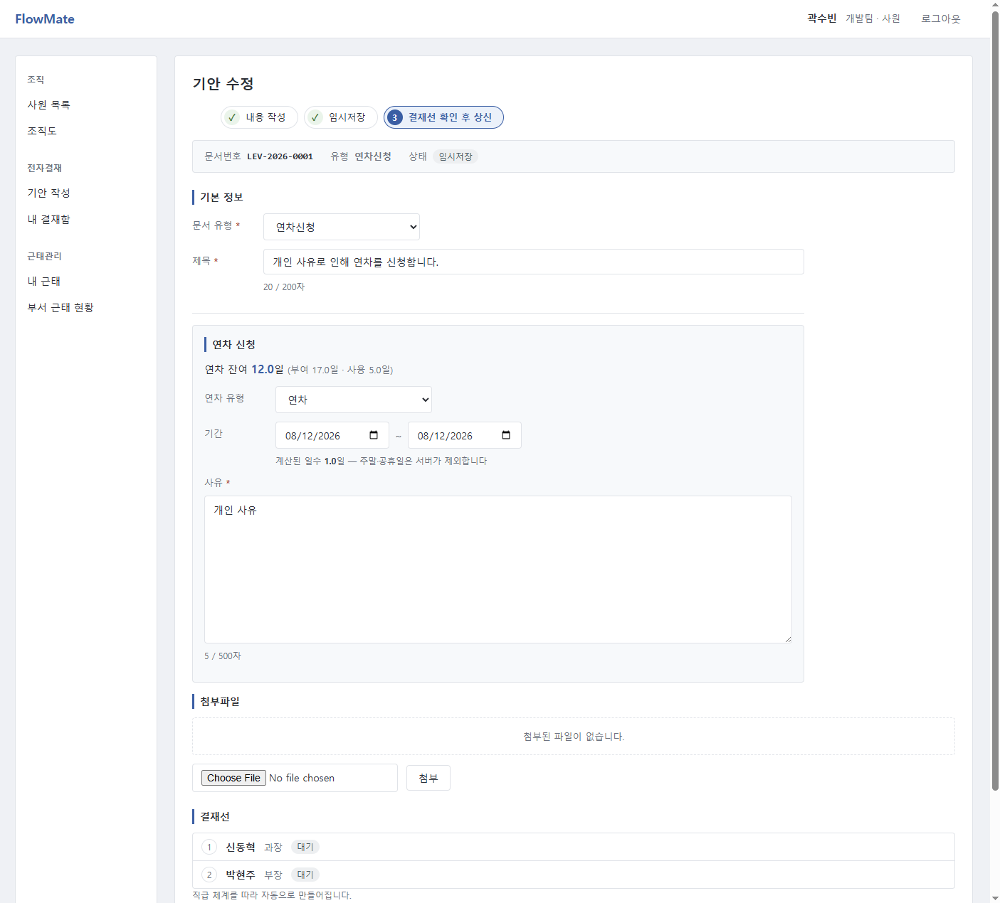
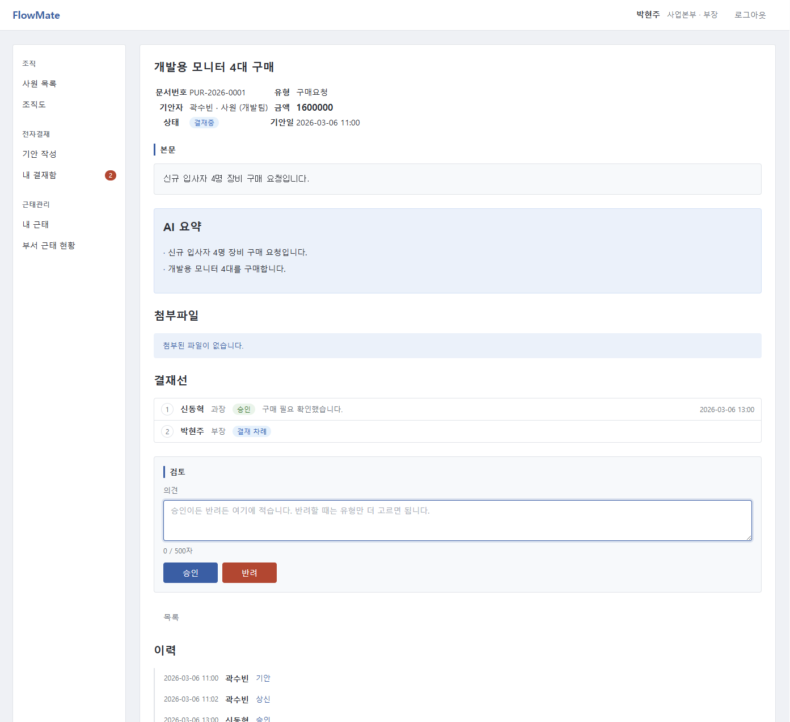
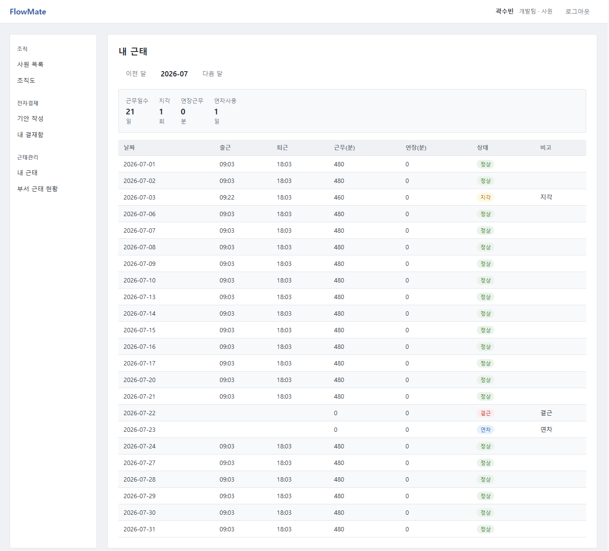

# FlowMate

**전자결재 · 근태관리 그룹웨어 — 과거 반려 이력에 근거해 AI가 상신 전에 점검합니다.**

> 이 프로젝트는 Claude(Claude Code)와 함께 만들었습니다. 설계·계획을 문서로 먼저 세우고
> 구현을 지시하고 결과를 검증했으며, 그 과정이 [`docs/superpowers/`](docs/superpowers/) 에
> 그대로 남아 있습니다.

| | |
|---|---|
| **언어 · 런타임** | Java 17 · 외부 Tomcat 10.1 (**WAR** 배포) |
| **프레임워크** | Spring Boot 3.5.16 · Spring MVC · Spring Security 6 (세션 로그인 · CSRF) |
| **화면** | JSP + Jakarta JSTL 3.0 · jQuery 3.7 · CSS 단일 파일 (UI 프레임워크 없음) |
| **데이터** | PostgreSQL 16 · MyBatis 3 (인터페이스 + XML 매퍼) |
| **AI** | Anthropic Java SDK 2.34 · Google Gen AI Java SDK 1.57 |
| **빌드 · 실행** | Maven · Docker Compose (PostgreSQL + 외부 Tomcat) |
| **테스트** | JUnit 5 · AssertJ · Surefire(단위) / Failsafe(통합) 분리 — **단위 180 · 통합 143** |


---

## 무엇을 하려는 프로젝트인가

회사에서 매일 쓰는 그룹웨어에서 반복되는 장면이 있었습니다. 결재를 올리고 며칠을
기다렸는데 반려되고, 사유를 열어 보면 아주 사소한 것들이었습니다.

- **실수로 증빙 자료를 업로드하지 못했다** — 문서는 다 썼는데 영수증 스캔 파일 하나가 빠졌다
- **출장 목적을 "업무협의"라고만 적었다** — 어디의 누구와 무슨 안건인지가 없다
- **사전 승인이 필요한 건인 줄 몰랐다** — 절차를 건너뛰고 바로 올렸다

전부 **올리기 전에 알았다면 30초면 고칠 수 있던 것들**입니다. 그리고 하나같이 같은 문서
유형에서 이미 여러 번 나왔던 이유입니다. 반려 이력은 시스템 안에 그대로 쌓여 있는데
아무도 그걸 읽지 않습니다. 그래서 이런 생각이 들었습니다.

> **"상신 버튼을 누르기 전에, 과거에 같은 부서·같은 유형에서 무엇 때문에 반려됐는지 알려주면 어떨까?"**

그래서 이 프로젝트의 AI는 **근거 없는 말을 하지 않습니다.** `approval_reject_history` 에
쌓인 실제 반려 유형을 집계해 같은 자료를 두 방향으로 씁니다.

- **상신 전 점검** — *"이 지적은 과거 3건의 실제 반려에 근거한다"* 는 숫자와 함께 보여줍니다.
- **본문 제안** — 그 부서에서 자주 빠뜨리는 항목이 들어가도록 뼈대를 잡아 줍니다.
  다만 문서를 대신 써 주지는 않습니다. 금액·거래처처럼 작성자만 아는 값은 지어내지 않고
  `[금액]` 처럼 자리표시자로 남깁니다.

*"더 자세히 쓰세요"* 같은 일반론은 하지 않는 것이 두 기능 공통의 전제입니다.

## 화면

**내 결재함** — 탭마다 건수가 붙어 "지금 내가 처리할 것"이 바로 보입니다. 대기·반려처럼
행동이 필요한 탭만 강조됩니다.



**기안 작성 — 지출결의** — 진행 단계(작성 → 임시저장 → 상신)를 먼저 보여주고, 문서 유형에
따라 필요한 칸만 나타납니다. 지출결의에는 금액 칸이 있습니다.



**기안 작성 — 연차신청** — 같은 화면인데 유형만 바꾼 것입니다. 금액 칸이 사라지고 잔여
연차·기간·사유가 나타나며, 일수는 주말·공휴일을 빼고 서버가 계산합니다.



**상신 전 사전점검** — 같은 부서·같은 유형의 과거 반려를 집계해 지적하고, **"과거 N건에
근거함"** 을 함께 보여줍니다. 무시하고 상신할 수도 있고, AI가 실패하면 모달 없이 그냥
상신됩니다.



**문서 상세 — 결재자 시점** — AI 요약, 결재선 진행 상태, 그리고 의견 칸 하나로 승인·반려를
모두 처리하는 검토 영역.



**내 근태** — 승인된 연차가 별도 입력 없이 `07-23` 에 반영돼 있습니다. 결재와 근태가 한
트랜잭션이라는 이 프로젝트의 중심 주장이 화면으로 보이는 지점입니다.



---

## 5분 안에 돌려보기

```powershell
.\mvnw.cmd clean package     # target/flowmate.war 생성 (코드를 바꿀 때만)
docker compose up -d         # PostgreSQL + 외부 Tomcat 10.1, 빈 볼륨이면 시드까지 자동
```

→ **http://localhost:18080/flowmate** · 계정 `2020003` / 비밀번호 `flowmate1!`

**API 키는 필요 없습니다.** `ai.enabled` 기본값이 `false` 라 키 없이 그대로 뜹니다 — AI 기능
4종만 꺼지고 전자결재·근태관리는 전부 정상 동작합니다.

<details>
<summary><b>AI 기능까지 켜서 보려면</b> — Gemini 무료 키, 5분</summary>

AI 기능 4종(문서 요약 · 상신 전 사전점검 · 기안 본문 제안 · 연차 맥락)을 실제로 보려면
LLM API 키가 하나 필요합니다. 기본 제공자는 **Gemini** 입니다 — 무료 등급이 있어 결제 수단
없이 시연할 수 있습니다.

**1) 키 발급** — [Google AI Studio](https://aistudio.google.com/app/apikey) 에서 구글 계정으로
로그인해 `Create API key` 를 누르면 `AIza...` 로 시작하는 문자열이 나옵니다.

**2) 키 등록** — 둘 중 하나를 고릅니다.

```powershell
# (A) 이 창에서만 쓰기 — 창을 닫으면 사라집니다
$env:GEMINI_API_KEY = 'AIza...'

# (B) 계정에 저장해 두기 — 한 번만 하면 새 창에서도 삽니다
[Environment]::SetEnvironmentVariable('GEMINI_API_KEY', 'AIza...', 'User')
# 등록한 뒤 새 PowerShell 창을 열고:
$env:GEMINI_API_KEY = [Environment]::GetEnvironmentVariable('GEMINI_API_KEY','User')
```

★ **키를 저장소 안에 두지 마십시오.** `.env` 도 `application.yml` 도 아닙니다. 이 프로젝트는
키를 환경변수로만 받고, `docker-compose.yml` 은 그 값을 컨테이너로 넘기는 배선만 갖고
있습니다 — 값 자체는 어디에도 커밋되지 않습니다.

**3) 켜서 띄우기**

```powershell
$env:AI_ENABLED = 'true'
docker compose up -d --force-recreate tomcat
```

**4) 확인** — 결재 문서 상세(예: `/approval/3`)를 열면 **AI 요약**이 실제 내용으로 채워집니다.
기안 작성 화면에서 **[AI 제안 받기]** 를 누르면 초안이 나오고, 임시저장 문서에서 **상신**을
누르면 사전점검 모달이 뜹니다.

> 화면 요소 자체는 AI 를 꺼도 그대로 있습니다. 꺼진 상태에서는 요약 자리에 "일시적으로
> 사용할 수 없습니다"가, 제안 버튼을 누르면 "제안을 가져오지 못했습니다"가 나옵니다 —
> 어느 쪽이든 결재 작성·상신은 막히지 않습니다.

**키가 없거나 잘못됐다면** 애플리케이션이 아예 뜨지 않습니다. Tomcat 은 살아 있으므로
화면은 **404** 로 보이는데, 그때는 로그를 보면 원인이 한 줄로 나옵니다.

```powershell
docker logs flowmate-tomcat | Select-String 'ai.enabled=true'
# ai.enabled=true 인데 환경변수 GEMINI_API_KEY 가 없습니다.
# 키를 설정하거나 ai.enabled 를 false 로 두십시오.
```

일부러 이렇게 만들었습니다 — 조용히 넘어가면 설정 실수가 "AI 가 일시적으로 안 되는 것"과
구별되지 않아 아무도 눈치채지 못한 채 AI 기능이 죽어 있게 됩니다(`LlmConfig` 참고).

**다시 끄려면** 환경변수를 비우고 올리면 됩니다. 기본값이 꺼짐이므로 그냥
`docker compose up -d --force-recreate tomcat` 만 해도 됩니다.

```powershell
$env:AI_ENABLED = ''
docker compose up -d --force-recreate tomcat
```

**Claude(Anthropic)로 바꾸려면** `application.yml` 에서 `ai.provider` 를 `claude`,
`ai.model` 을 `claude-opus-5` 로 함께 바꾸고 `ANTHROPIC_API_KEY` 를 같은 방식으로 넣습니다
(모델명만 바꾸면 provider 가 그대로라 효과가 없습니다). 코드는 한 줄도 바뀌지 않습니다.

</details>

---

## 직접 해보기

아래 4명으로 로그인해 ①~④를 순서대로 따라가면 이 프로젝트의 주장이 화면에서 확인됩니다.

| 사원번호 | 이름 | 부서 · 직급 | 역할 |
|---|---|---|---|
| `2020003` | 곽수빈 | 개발팀 · 사원 | **기안자** |
| `2016004` | 신동혁 | 개발팀 · 과장 | 1차 결재 |
| `2016002` | 박현주 | 사업본부 · 부장 | 2차 결재 |
| `2015001` | 정도현 | 대표이사실 · 이사 | 임원 결재(300만원 초과) |

### ① 결재와 근태가 한 트랜잭션으로

1. **곽수빈**으로 로그인 → 기안 작성 → 유형 **연차신청** → 기간 입력 → **상신**
   (AI가 켜져 있으면 과거 반려 이력에 근거한 사전점검 모달이 뜹니다)
2. **신동혁** → 내 결재함 **대기** 탭 → 승인
3. **박현주** → 대기 탭 → 최종 승인
4. 곽수빈으로 돌아가 **잔여 연차가 줄고**, 내 근태에 해당 기간이 **'연차'로 자동 반영된 것**을 확인

### ② 설정값 하나로 결재 규칙 변경

1. 곽수빈으로 지출결의 **100만원** → 결재선 `신동혁 → 박현주`
2. **500만원**으로 바꾸면 → `정도현(이사)` 추가 (300만원 초과 규칙)
3. `application.yml` 의 `flowmate.approval.line-policy` 를 `simple-two-step` 으로 바꾸고 재기동
   → 같은 500만원인데 결재선이 **부서장 1명**으로 줄어듭니다. **코드는 한 줄도 안 고칩니다.**

### ③ 반려가 AI의 재료가 된다

신동혁이 반려할 때 **유형 선택이 필수**입니다. 그 유형이 `approval_reject_history` 에 쌓이고,
①의 사전점검이 이 표를 읽어 *"과거 반려 3건에 근거함"* 이라는 숫자를 만듭니다.
자유 텍스트만 받으면 이 집계가 불가능하다는 것이 유형을 필수로 둔 이유입니다.

### ④ 같은 이력이 반대 방향으로도 쓰인다 (AI 켰을 때)

기안 작성의 본문 칸 아래 **[AI 제안 받기]** 를 누르면, 같은 반려 이력을 근거로 이번에는
**쓰기 전에** 뼈대를 잡아 줍니다. 사전점검이 *"이대로 올리면 반려된다"* 라면 이건
*"이 부서에서 자주 빠뜨리는 항목을 미리 넣어 두자"* 입니다.

모르는 값은 지어내지 않고 `[금액]` 처럼 자리표시자로 남기며, 이미 쓴 내용은 지우지 않고
살려서 다듬습니다. 제안은 **[본문에 넣기]** 를 눌러야 적용됩니다.

---

## 아키텍처

```
[브라우저]  JSP/JSTL + jQuery, 세션 로그인(Spring Security 6)
    ↓
[Controller]  com.flowmate.{org,approval,attendance,ai}.controller
    ↓
[Service]  트랜잭션 경계
    │  연차 승인은 approval → attendance 를 이벤트가 아니라
    │  같은 트랜잭션에서 직접 호출한다 (인터페이스로만 결합)
    ↓
[Mapper]  MyBatis 3 (인터페이스 + XML)
    ↓
[PostgreSQL 16]  Oracle 대응은 docs/oracle-mapping.md
```

**AI 게이트웨이** — 기능 4종이 이 뒤에 선다.

```
[SummaryService]  [PreflightService]  [DraftHintService]  [LeaveContextService]
                                                            (LLM 미사용)
    ↓
LlmClient 데코레이터 체인
    Caching → Masking → Logging → Resilient → ClaudeLlmClient (Anthropic)
                                              GeminiLlmClient (Google)
                                              FakeLlmClient   (키 없을 때)
```

- **Caching** 이 가장 바깥 — 히트하면 마스킹도 API 호출도 하지 않습니다.
- **Masking** 이 실제 호출보다 바깥이어야 합니다. LLM 응답은 입력을 인용할 수 있어서,
  마스킹이 호출 뒤에 있으면 응답이 원문을 실어 와 캐시와 로그에 그대로 남습니다.
- 실제 클라이언트는 `ai.enabled` + `ai.provider` 로 셋 중 하나만 배선됩니다.

패키지 루트는 `com.flowmate.{org, approval, attendance, ai, common, config}` 6개입니다.
`approval` 이 `attendance.service.LeaveApplyService` **인터페이스만** 알고 구현이나 매퍼를
모르므로 의존 방향은 `approval → attendance` 한쪽입니다(순환 없음).

---

## 커스터마이징 지점

그룹웨어는 회사마다 결재 규칙도 근무 시간도 다릅니다. 그런 것들을 코드가 아니라 설정으로
바꿀 수 있게 미리 갈라 뒀습니다. **다섯 지점 모두 구현체를 2개씩 만들어 설정값 하나로
교체되는 것을 테스트로 고정합니다** (같은 입력, 다른 설정 → 다른 결과).

| # | 인터페이스 | 구현체 | 설정 키 |
|---|---|---|---|
| 1 | `ApprovalLinePolicy` | Default(부서 트리 + 임원) / SimpleTwoStep(부서장 1명) | `flowmate.approval.line-policy` |
| 2 | `LeaveGrantPolicy` | Flat(전원 15일) / TenureBased(근속 비례) | `flowmate.attendance.leave-grant-policy` |
| 3 | `WorkTimePolicy` | Default(09-18 고정) / Flexible(코어타임) | `flowmate.attendance.work-time-policy` |
| 4 | `PromptRepository` | File(classpath) / Database(`ai_prompt`, 5분 TTL) | `ai.prompt-repository` |
| 5 | `ai.features.*` | 기능별 on/off (summary · preflight · draft-hint · leave-context) | `ai.features.summary` 등 |

---

## 테스트

| 구분 | 파일 규칙 | 실행 | DB |
|---|---|---|---|
| 단위 **180건** | `*Test.java` | `mvnw.cmd test` | 불필요 |
| 통합 **143건** | `*IT.java` | `mvnw.cmd verify` | 필요 |

**API 키 없이 `mvnw clean verify` 가 통과하는 것이 지켜야 할 계약입니다.** AI 기능 4종은
`FakeLlmClient` 로 마스킹·캐싱·폴백·기능 플래그까지 체인 수준에서 검증됩니다. 단위 테스트가
DB 없이 도는 경계도 의도적으로 유지합니다 — 무너지면 순수 로직 테스트가 컨테이너 기동에
묶여 빠른 피드백을 잃습니다.

실제 LLM 응답 품질은 **고정 평가셋 8건**으로 봅니다(사전점검 5 · 기안 제안 3).
`@Tag("llm")` 이라 기본 빌드에서는 제외되고, 키가 있을 때만 수동으로 돕니다 —
**사전점검 5/5 · 기안 제안 3/3**, 기록은 [`docs/ai-eval-results.md`](docs/ai-eval-results.md).

<details>
<summary>평가셋 수동 실행</summary>

```powershell
$env:GEMINI_API_KEY = [Environment]::GetEnvironmentVariable('GEMINI_API_KEY','User')
.\mvnw.cmd verify "-Dit.test=*EvalSetIT" "-Dgroups=llm" `
    "-Dflowmate.eval.excludedGroups=" "-Dai.enabled=true"
```

`-Dgroups=llm` 만으로는 부족합니다. `pom.xml` 의 `excludedGroups` 기본값이 이미 `llm` 이라,
켜는 필터와 끄는 필터가 같은 태그를 가리키면 끄는 쪽이 항상 이깁니다(JUnit5 태그 결합 규칙).
</details>

---